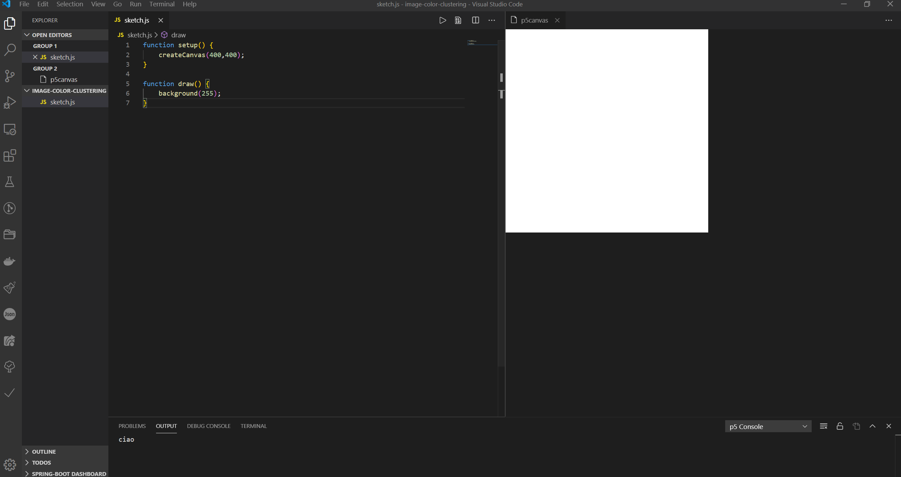

# p5-live-editor

This extension let you code your p5js projects live in Visual Studio Code. There are other plugins that le you do the same but all have some troubles, so I decided to "merge" them in order to create a more useful editor for my classroom lessons.



In order to use the plugin you must create a sketch.js file in your project folder. You can also use multiple .js files, the plugin will manage them automatically.

```javascript
function setup() {
  createCanvas(400, 400);
}

function draw() {
  background(255);
}
```

## Features

- Start as simple as a single sketch.js file
- include multiple files simply creating them in the repository folder
- JSHint integration to find errors
- Fully ES 6 compatible

## Usage

If a JavaScript file is open, a p5-live-editor button appears in the status bar bottom left. Click on it, to open the preview.

## Known Issues

There are currently no known issues. If you find any issues, please feel free, to fill an issue on github [Github](https://github.com/ProfAndreaPollini/vscode-p5-live-editor/issues).

## Release Notes

### 0.2.0

- added project management

### 0.1.1

- Fixed some typo

### 0.1.0

- First release

## License

This Library is licensed under the MIT License. Please refer to the `LICENSE.txt` for more information.

## Plugin I've taken code from

I try to merge the feature of two great plugins: https://github.com/filipesabella/vscode-live-p5 and many of the code is taken from https://github.com/pixelkind/p5canvas (I forked this repo)
Icons from: https://github.com/tabler/tabler-icons